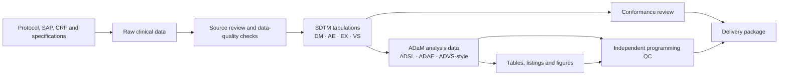

# Clinical SAS Programming Workshops

[](https://github.com/sakshianil/SAS-workshop-material/actions/workflows/validate.yml)
[](https://www.sas.com/en_us/software/on-demand-for-academics.html)
[](#choose-your-learning-track)

An applied, job-oriented introduction to SAS programming in clinical research.
The repository contains two complementary learning tracks that move from
source data and study documents to SDTM, ADaM, tables, listings, and figures,
followed by independent quality control.

The workshops are designed for learners who understand concepts best when they
can run the code, inspect the SAS log, examine intermediate datasets, and trace
a reported result back to its source.

> **Educational use:** These materials demonstrate clinical programming
> patterns. They are not validated production systems, official CDISC training,
> medical guidance, or submission-ready deliverables.

> **Data confidentiality:** No confidential clinical-trial or real patient data
> are used. The beginner workshop uses artificially generated, hypothetical
> simulation data. The reference workshop uses selected public CDISC
> test/pilot artifacts with attribution and integrity checks.

## Why this repository exists

Clinical SAS training often teaches syntax separately from the work that gives
the syntax meaning. This repository takes the opposite approach:

- Every SAS feature is introduced inside a clinical programming task.
- The same records are followed across multiple data layers.
- Specifications, derivations, reporting, and QC are treated as one connected
  workflow.
- Exercises include completed solutions and machine-checkable checkpoints.
- The public CDISC pilot data are used in a separate reference-based track with
  their original attribution and integrity hashes preserved.

## Choose your learning track

| Track | Best for | Time | Data | Outcome |
|---|---|---:|---|---|
| [Clinical SAS Hands-On Workshop](clinical-sas-workshop/) | New SAS and clinical-programming learners | 10–12 hours | Fully synthetic Phase III study | Build an end-to-end workflow from CSV source data through SDTM-style and ADaM-style datasets to TLFs and QC |
| [CDISC Pilot Mini-Workshop](cdisc-pilot-mini-workshop/) | Learners ready to inspect authentic standards-based artifacts | 4–6 hours | Selected unchanged files from the CDISC pilot project | Trace DM/AE into ADSL/ADAE, reproduce occurrence flags, and QC a serious-AE table |

Recommended order:

1. Complete the synthetic workshop to understand the workflow.
2. Complete the CDISC pilot workshop to inspect a realistic reference package.
3. Revisit the first workshop and explain each derivation using the language of
   traceability, populations, denominators, and validation.

See the detailed [learning path](docs/LEARNING_PATH.md).

## Clinical programming pipeline



The implementation emphasizes several habits expected in professional clinical
programming:

- Read the protocol, SAP, annotated CRF, controlled terminology, and mapping
  specifications before programming.
- Preserve source-to-output traceability.
- Make population and denominator rules explicit.
- Distinguish a subject count from an event-record count.
- Treat the SAS log as a deliverable.
- Reproduce critical results independently rather than reviewing only the
  production code.

More detail is available in
[Clinical Programming Pipeline](docs/CLINICAL_PROGRAMMING_PIPELINE.md).

## Repository layout

```text
.
├── clinical-sas-workshop/          # Synthetic end-to-end learning study
├── cdisc-pilot-mini-workshop/      # Reference-based CDISC pilot labs
├── outputs/                        # Redacted SAS runtime evidence
├── docs/                           # Learning path, pipeline and resources
├── tests/                          # Repository publication checks
├── .github/workflows/              # Automated validation
├── CLAUDE.md                       # Reproducibility and data-governance rules
├── CONTRIBUTING.md
├── LICENSE
└── LICENSES.md
```

Each lesson directory follows a consistent pattern:

```text
README.md             Concept, objective and workplace relevance
lesson.sas            Guided demonstration
exercise.sas          Deliberate practice
check_your_work.sas   Automated SAS checkpoint
solution.sas          Complete reference implementation
```

## Quick start with SAS OnDemand

1. Create or access a free
   [SAS OnDemand for Academics](https://welcome.oda.sas.com/) account.
2. Download this repository or the workshop folder you want to use.
3. Upload the selected folder into SAS Studio.
4. Open its `START_HERE.md`.
5. Set the documented `PROJECT_ROOT` path.
6. Run the setup and import programs in order.
7. Complete lessons without jumping directly to the solutions.

Detailed setup:

- [Synthetic workshop setup](clinical-sas-workshop/START_HERE.md)
- [CDISC pilot setup](cdisc-pilot-mini-workshop/START_HERE.md)

## Portfolio website

This repository also includes a lightweight GitHub Pages showcase in
[`docs/index.html`](docs/index.html). It introduces the workshop, embeds the
HeyGen professional intro video when HeyGen permits iframe playback, and provides
direct calls to action for learners who want to use or star the repository.

To publish it, enable GitHub Pages from branch `main` and folder `/docs`. See
[`docs/GITHUB_PAGES.md`](docs/GITHUB_PAGES.md) for the exact settings.

## Datasets

### Synthetic Phase III study

The first workshop contains fictional demographics, adverse events, exposure,
and vital-sign source files for approximately 60 subjects. The data deliberately
include partial dates, screen failures, missed doses, early discontinuations,
ongoing events, inconsistent source terminology, and repeated measurements.

These are artificially created simulation data. They are designed to behave
like realistic clinical-programming inputs, but they do not represent a real
study, real participants, real treatments, or real outcomes. No real patient
information, PHI, PII, or sponsor-confidential information is included.

### CDISC pilot study

The second workshop uses selected unchanged artifacts from
[cdisc-org/sdtm-adam-pilot-project](https://github.com/cdisc-org/sdtm-adam-pilot-project):

| Layer | Dataset | Records | Role in the workshop |
|---|---|---:|---|
| SDTM | DM | 306 | Submitted subject-level demographics |
| SDTM | AE | 1,191 | Submitted adverse events |
| ADaM | ADSL | 254 | Analysis subjects, treatments and populations |
| ADaM | ADAE | 1,191 | Analysis dates, treatment-emergent and occurrence flags |

The associated XPT, Dataset-JSON, Define-XML, and selected reference programs
are retained with CDISC attribution. SHA-256 checks protect the copied source
artifacts from accidental modification.

These files are public CDISC test/pilot reference material. They are not
confidential sponsor data, and this repository does not claim to have created
them. Their original terms and disclaimer remain applicable.

## Runtime proof

The root [`outputs/`](outputs/) directory is reserved for redacted evidence
from actual SAS executions. When provided, it can contain completed run
manifests, SAS logs, HTML/RTF reports, screenshots, dataset counts, and
`PROC COMPARE` results tied to a specific Git commit.

No runtime evidence should contain real patient data, confidential trial
information, usernames, credentials, or private filesystem paths.

Available evidence:

- [Module 09 systolic-BP figure generated in SAS OnDemand on 2026-06-19](outputs/clinical-sas-workshop/2026-06-19-sas-ondemand/)
  — partial runtime proof with a redacted HTML wrapper, PNG figure, checksums,
  and an evidence manifest.

## Video context

The synthetic workshop was organized after reviewing long-form public training
sessions that describe clinical-programming workflows. The workshop is an
original learning implementation; it does not reproduce the trainers' course
materials or transcript text.

- [CDISC SDTM ADaM TLF's Training for Beginners](https://www.youtube.com/watch?v=MOp9Q9mt2RI)
  — industry workflow, clinical documents, standards, and reporting context.
- [SAS Clinical Programming Training — CDISC, SDTM & ADaM Full Course](https://www.youtube.com/watch?v=XweS2i9ZdNY)
  — protocol/SAP review, extraction, annotation, and DM/EX/AE/VS mapping.
- [Clinical SAS Real-Time Projects — CDISC Tutorial](https://www.youtube.com/watch?v=Q1P-FG69jf8)
  — analysis listings, demographic and AE tables, figures, ADAE/ADVS, macros,
  and validation concepts.

A module-level watch-along map is included in the
[transcript guide](clinical-sas-workshop/transcript_notes/TRANSCRIPT_GUIDE.md).

## Recommended references

- [SAS OnDemand for Academics](https://www.sas.com/en_us/software/on-demand-for-academics.html)
- [CDISC SDTM Implementation Guide](https://www.cdisc.org/standards/foundational/sdtmig)
- [CDISC ADaM standards](https://www.cdisc.org/standards/foundational/adam)
- [CDISC Define-XML](https://www.cdisc.org/standards/data-exchange/define-xml)
- [CDISC Dataset-JSON](https://www.cdisc.org/standards/data-exchange/dataset-json)
- [FDA Study Data Technical Conformance Guide](https://www.fda.gov/industry/fda-data-standards-advisory-board/study-data-technical-conformance-guide-technical-specifications-document)
- [Pinnacle 21 Community](https://help.pinnacle21.certara.net/en/articles/9736610-download-pinnacle-21-community)
- [SAS Programming documentation](https://documentation.sas.com/)

See [Resources](docs/RESOURCES.md) for a curated reading sequence.

## Validation

From the repository root:

```bash
python3 tests/validate_repository.py
```

The validation checks:

- Required documentation and lesson structure.
- Synthetic source-data scenarios and expected counts.
- CDISC source checksums and Dataset-JSON metadata.
- DM-to-ADSL and AE-to-ADAE lineage.
- Treatment-emergent and occurrence-flag recreation.
- Absence of raw transcript exports, duplicate ZIP files, and OS-generated
  files from the published repository.

SAS runtime verification is performed by running each workshop's setup checks
and final `run_all_solutions.sas` program in SAS OnDemand.

The complete reproducibility contract, expected counts, execution order, and
evidence-publication rules are documented in [`CLAUDE.md`](CLAUDE.md).

## Licensing and attribution

Repository-authored code and documentation are released under the
[MIT License](LICENSE). Selected CDISC files remain governed by the terms
included in the source project and documented in
[LICENSES.md](LICENSES.md) and
[the pilot attribution notice](cdisc-pilot-mini-workshop/ATTRIBUTION_AND_TERMS.md).

SAS, CDISC, FDA, Certara, Pinnacle 21, YouTube, and the referenced training
providers are independent organizations. Their names and links are used for
identification and educational context; no endorsement or affiliation is
implied.
