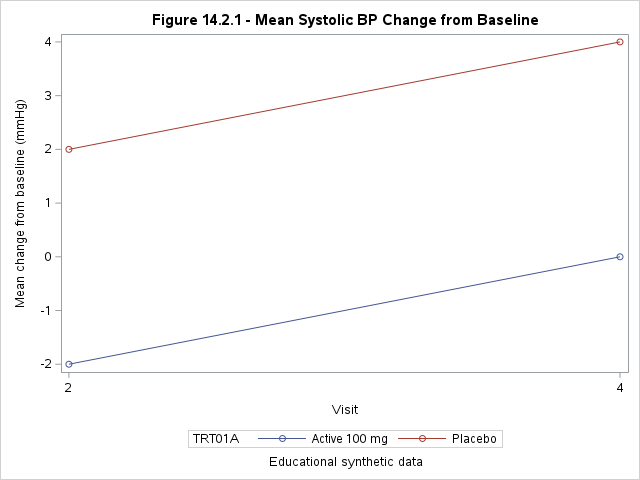

# SAS OnDemand Runtime Evidence — 2026-06-19

This folder contains the first supplied runtime artifacts from
`clinical-sas-workshop`, generated with SAS 9.4 in a SAS OnDemand-style server
environment.

## Evidence included

- [`SGPlot1.png`](SGPlot1.png) — Figure 14.2.1, mean systolic blood-pressure
  change from baseline by treatment and visit.
- [`table_14_3_1_and_figure.html`](table_14_3_1_and_figure.html) — portable HTML
  wrapper for the figure.
- [`RUN_MANIFEST.md`](RUN_MANIFEST.md) — execution context, privacy review,
  observed evidence, and limitations.
- [`SHA256SUMS.txt`](SHA256SUMS.txt) — checksums for the published artifacts.

## Interpretation

For the simulated study data:

- Active 100 mg shows mean systolic-BP changes of approximately `-2 mmHg` at
  Week 2 and `0 mmHg` at Week 4.
- Placebo shows mean changes of approximately `+2 mmHg` at Week 2 and
  `+4 mmHg` at Week 4.

These values are educational results from artificially generated,
hypothetical data. They are not clinical evidence and must not be interpreted
as treatment efficacy.

## Publication note

The supplied HTML contained an absolute SAS server path that disclosed an
account-specific home directory. The published copy changes only the image
reference and alt text:

- absolute server image path → relative `SGPlot1.png`;
- generic SGPlot alt text → descriptive figure alt text.

The PNG is published byte-for-byte unchanged. Original and published checksums
are recorded in the run manifest.

## Evidence status

This is **partial runtime evidence**. It proves that the figure was generated
and exported. The supplied HTML does not contain the adverse-event table rows
suggested by its filename, and no SAS log, setup-check output, source-count
report, or `PROC COMPARE` result was supplied with this evidence package.

The full workshop should be described as SAS-runtime verified only after those
additional artifacts are added.
